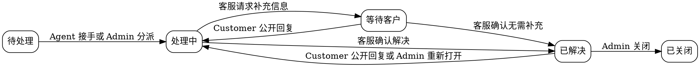

> 来源：proposal.md
> 生成时间：2026-08-21
> 阶段：spec
> 交付范围：ResolveDesk 全栈一期（不含 AI Copilot）

# ResolveDesk 全栈一期功能规格

## Why

当前系统是 Full Stack FastAPI Template，已具备注册登录、JWT 鉴权、用户管理、个人设置和 Item CRUD，但只有普通用户与超级管理员两级权限，缺少可体现复杂业务建模、角色协作、状态流转和数据权限的实际业务。

本期将系统改造为单工作空间客服工单平台，形成 Customer 提交问题、Agent 接手处理、Admin 管理和监督的完整闭环。开发必须按“后端完成并验证 → 前端完成并验证 → 联调验收”的顺序推进，为后续 AI Copilot 提供稳定业务基础。

## What

### 1. 功能需求

| 编号 | 功能 | 验收标准 | 优先级 |
|---|---|---|---|
| FR-01 | 三角色用户模型 | 每个用户必须且只能拥有 `CUSTOMER`、`AGENT`、`ADMIN` 中的一个角色；公开注册用户默认为 Customer；只有 Admin 可以修改其他用户角色 | P0 |
| FR-02 | 用户状态管理 | Admin 可以启用或停用用户；停用用户不能登录；停用 Agent 不得接手或被分派新工单，其已有未结束工单必须在用户列表和工单列表中明确可识别 | P0 |
| FR-03 | Customer 创建工单 | 已登录 Customer 可以使用标题、问题描述、分类创建工单；新工单默认为 `OPEN`、`MEDIUM`、未分派，并记录创建人和创建时间 | P0 |
| FR-04 | 角色化工单列表 | Customer 只能列出自己的工单；Agent 只能列出未分派工单和分派给自己的工单；Admin 可以列出全部工单 | P0 |
| FR-05 | 工单筛选与分页 | 工单列表支持按状态、优先级、分类、负责人筛选，并支持关键字匹配标题或工单编号；筛选结果必须分页并返回总数 | P0 |
| FR-06 | 工单详情 | 有权访问工单的用户可以查看基础信息、当前负责人和按时间排序的消息时间线；Customer 不得看到内部备注 | P0 |
| FR-07 | Agent 接手工单 | 活跃 Agent 可以接手未分派且未关闭的工单；接手成功后负责人变为该 Agent，状态由 `OPEN` 变为 `IN_PROGRESS` | P0 |
| FR-08 | Admin 分派与转派 | Admin 可以把未关闭工单分派或转派给活跃 Agent，也可以取消分派；分派给 Agent 后，`OPEN` 工单变为 `IN_PROGRESS` | P0 |
| FR-09 | 公开回复 | Customer 可以回复自己的未关闭工单；负责该工单的 Agent 和 Admin 可以发送公开回复；所有有权访问该工单的角色均可看到公开回复 | P0 |
| FR-10 | 内部备注 | 负责该工单的 Agent 和 Admin 可以添加内部备注；Customer 在任何接口和页面均不可获得内部备注内容或其存在数量 | P0 |
| FR-11 | 工单状态流转 | 系统只允许本规格定义的状态转换；每次成功转换必须记录操作者、原状态、新状态和时间 | P0 |
| FR-12 | 优先级与分类 | 负责工单的 Agent 和 Admin 可以修改未关闭工单的优先级和分类；Customer 不可修改；变更必须进入操作记录 | P0 |
| FR-13 | 工单操作记录 | 接手、分派、取消分派、转派、状态、优先级、分类和删除操作均生成不可由普通用户修改的记录 | P0 |
| FR-14 | Admin 用户管理 | Admin 可以分页查询用户，并按角色、启用状态筛选；可以创建用户、修改角色和启用状态；不能停用或删除当前登录的唯一活跃 Admin | P0 |
| FR-15 | 基础统计 | Customer 查看自己的各状态工单数量；Agent 查看未分派、分派给自己和等待客户的数量；Admin 查看全局各状态、优先级及未分派工单数量 | P1 |
| FR-16 | Admin 删除工单 | Admin 可以删除工单；删除前必须明确确认；删除后工单及消息不再出现在业务查询中，但删除操作记录必须保留 | P1 |
| FR-17 | 角色化前端工作台 | 三种角色登录后只显示有权使用的导航、列表、详情和操作；仅隐藏按钮不视为权限控制，越权请求仍必须由后端拒绝 | P0 |
| FR-18 | 自动生成前端契约 | 后端 OpenAPI 契约更新后，前端使用生成客户端访问工单和用户接口；页面不得额外维护重复接口定义 | P0 |
| FR-19 | 自动化测试 | 后端覆盖三角色权限、状态流转、并发接手、内部备注隔离和筛选；前端 E2E 覆盖三角色关键业务闭环 | P0 |

### 2. 固定业务枚举

#### 用户角色

| 值 | 中文名称 | 定义 |
|---|---|---|
| `CUSTOMER` | 客户 | 提交和跟踪自己的工单 |
| `AGENT` | 客服 | 从公共队列接手工单并负责处理 |
| `ADMIN` | 管理员 | 管理用户、角色和全部工单 |

#### 工单状态

| 值 | 中文名称 | 定义 |
|---|---|---|
| `OPEN` | 待处理 | 工单已创建，尚未开始处理 |
| `IN_PROGRESS` | 处理中 | 工单已有负责人并正在处理 |
| `WAITING_FOR_CUSTOMER` | 等待客户 | 客服已请求客户补充信息 |
| `RESOLVED` | 已解决 | 客服认为问题已经解决，仍允许客户反馈未解决 |
| `CLOSED` | 已关闭 | 工单流程结束，不允许继续回复或修改业务字段 |

#### 工单优先级

`LOW`（低）、`MEDIUM`（中）、`HIGH`（高）、`URGENT`（紧急）。

#### 工单分类

`ACCOUNT`（账户）、`BILLING`（账单）、`PRODUCT`（产品使用）、`BUG`（故障）、`FEATURE_REQUEST`（功能建议）、`OTHER`（其他）。

#### 消息类型

- `PUBLIC_REPLY`：客户、负责客服和管理员可见。
- `INTERNAL_NOTE`：当前负责人 Agent 和 Admin 可见；浏览未分派工单的 Agent 不可见。

### 3. 权限矩阵

| 操作 | Customer | Agent | Admin |
|---|:---:|:---:|:---:|
| 创建工单 | 自己 | 否 | 否 |
| 查看工单列表 | 仅自己的 | 未分派及自己负责 | 全部 |
| 查看工单详情 | 仅自己的 | 未分派及自己负责 | 全部 |
| 接手未分派工单 | 否 | 是 | 是 |
| 分派/转派给其他 Agent | 否 | 否 | 是 |
| 取消分派 | 否 | 否 | 是 |
| 发送公开回复 | 自己的未关闭工单 | 自己负责的未关闭工单 | 任意未关闭工单 |
| 添加内部备注 | 否 | 自己负责的未关闭工单 | 任意未关闭工单 |
| 修改状态 | 仅通过回复触发重新处理 | 自己负责的工单，按状态规则 | 任意工单，按状态规则 |
| 修改优先级/分类 | 否 | 自己负责且未关闭 | 任意未关闭工单 |
| 查看操作记录 | 自己工单的非内部记录 | 可访问工单的记录 | 全部记录 |
| 删除工单 | 否 | 否 | 是 |
| 查询用户目录 | 否 | 仅可用于识别自己，不提供目录 | 是 |
| 管理用户与角色 | 否 | 否 | 是 |
| 查看统计 | 个人 | 本人工作队列 | 全局 |

**操作记录可见性规则：** Customer 可以看到状态变化和公开沟通相关记录，但不得看到内部备注记录、客服内部操作说明或其他敏感管理信息。

**不做的事：**

- 不实现多租户 Workspace、团队、客服组长或按团队分派。
- 不实现 AI Copilot、RAG、Embedding、Tool Calling 或模型调用。
- 不实现实时聊天、WebSocket、邮件收件转工单、SLA、附件、标签、自定义字段和满意度评价。
- 不实现批量工单操作、批量用户导入和数据导出。
- 不替换现有 JWT 登录、密码重置、邮件和 Docker 基础设施，除非为三角色兼容所必需。

## How

### 1. 正常流程

#### 1.1 注册与角色管理

1. 访客公开注册后成为活跃 Customer。
2. Admin 可以创建 Customer、Agent 或 Admin。
3. Admin 可以修改其他用户的角色及启用状态。
4. Agent 和 Customer 不可查询用户管理列表或修改角色。
5. 用户登录后，系统依据当前角色返回对应导航和数据。

#### 1.2 Customer 提交和跟踪工单

1. Customer 填写标题、问题描述和分类。
2. 系统创建 `OPEN`、`MEDIUM`、未分派工单，并生成不可变工单编号。
3. Customer 在“我的工单”中按时间倒序看到该工单。
4. Customer 可以查看公开时间线并补充公开回复。
5. 当 Customer 回复 `WAITING_FOR_CUSTOMER` 或 `RESOLVED` 工单时，工单自动进入 `IN_PROGRESS`；原负责人保持不变。
6. `CLOSED` 工单只读，Customer 不能继续回复。

#### 1.3 Agent 接手和处理工单

1. Agent 查看未分派公共队列和“分派给我”的工单。
2. Agent 接手一个未分派工单。
3. 接手成功后该 Agent 成为负责人，工单进入 `IN_PROGRESS`。
4. Agent 可发送公开回复、添加内部备注、调整优先级和分类。
5. 需要客户补充信息时，Agent 将状态改为 `WAITING_FOR_CUSTOMER`。
6. 问题处理完成后，Agent 将状态改为 `RESOLVED`。
7. Agent 不得访问其他 Agent 已负责的工单详情，也不得自行转派。

#### 1.4 Admin 管理工单

1. Admin 查看和筛选全部工单。
2. Admin 将工单分派给活跃 Agent，或将已有负责人转派给另一活跃 Agent。
3. Admin 可取消分派；未关闭工单取消分派后状态变为 `OPEN`。
4. Admin 可以执行负责人 Agent 能执行的工单操作。
5. Admin 可以将 `RESOLVED` 工单关闭；关闭后工单只读。
6. Admin 删除工单前必须进行明确确认，删除结果不再出现在业务列表和详情中。

#### 1.5 状态流转

允许的主动状态转换：

| 当前状态 | 操作者 | 允许变更为 |
|---|---|---|
| `OPEN` | Agent/Admin 接手或分派 | `IN_PROGRESS` |
| `IN_PROGRESS` | 负责 Agent/Admin | `WAITING_FOR_CUSTOMER`、`RESOLVED` |
| `WAITING_FOR_CUSTOMER` | 负责 Agent/Admin | `IN_PROGRESS`、`RESOLVED` |
| `WAITING_FOR_CUSTOMER` | Customer 公开回复 | 自动变为 `IN_PROGRESS` |
| `RESOLVED` | Customer 公开回复 | 自动变为 `IN_PROGRESS` |
| `RESOLVED` | Admin | `IN_PROGRESS`、`CLOSED` |
| `CLOSED` | 任意角色 | 不允许变更 |

### 2. 关键验收场景

#### 场景 FR-01：公开注册用户默认为 Customer

- **Given** 访客使用未注册邮箱提交合法注册信息
- **When** 注册成功并登录
- **Then** 当前用户角色为 `CUSTOMER`，且不能访问 Agent 队列和 Admin 用户管理

#### 场景 FR-04：Customer 不能访问他人工单

- **Given** Customer A 与 Customer B 均已创建工单
- **When** Customer A 查询列表或使用 Customer B 的工单 ID 请求详情
- **Then** 列表不包含 Customer B 的工单，详情请求被拒绝，且不返回工单内容

#### 场景 FR-04：Agent 的数据范围

- **Given** 存在未分派工单、分派给 Agent A 的工单、分派给 Agent B 的工单
- **When** Agent A 查询工单列表
- **Then** 结果只包含未分派工单和分派给 Agent A 的工单

#### 场景 FR-07：Agent 接手未分派工单

- **Given** 活跃 Agent 正在查看一个 `OPEN` 且未分派的工单
- **When** Agent 执行接手
- **Then** 工单负责人变为该 Agent、状态变为 `IN_PROGRESS`，并新增接手操作记录

#### 场景 FR-07：两个 Agent 同时接手

- **Given** 两个活跃 Agent 同时看到同一个未分派工单
- **When** 两者先后提交接手请求
- **Then** 只有一个请求成功，另一个收到“工单已被接手”的冲突结果，负责人不会被后一个请求覆盖

#### 场景 FR-08：Admin 转派工单

- **Given** 工单当前由 Agent A 负责，Agent B 处于活跃状态
- **When** Admin 将工单转派给 Agent B
- **Then** 负责人变为 Agent B，Agent A 不再能访问该工单详情，操作记录包含转派前后负责人

#### 场景 FR-09：Customer 回复等待中的工单

- **Given** Customer 自己的工单处于 `WAITING_FOR_CUSTOMER`
- **When** Customer 添加公开回复
- **Then** 回复出现在公开时间线，工单自动变为 `IN_PROGRESS`，负责人不变

#### 场景 FR-10：内部备注隔离

- **Given** Agent 在自己负责的工单添加内部备注
- **When** Agent、Admin 和该工单 Customer 分别查询详情
- **Then** Agent 与 Admin 可以看到备注，Customer 的响应中不包含备注正文、类型、数量或可推断其存在的占位信息

#### 场景 FR-11：关闭工单不可修改

- **Given** Admin 已将 `RESOLVED` 工单变为 `CLOSED`
- **When** Customer、Agent 或 Admin 尝试回复或修改状态、优先级、分类和负责人
- **Then** 请求被拒绝，工单内容保持不变

#### 场景 FR-12：Agent 不能修改他人工单

- **Given** 工单已分派给 Agent B
- **When** Agent A 直接请求修改该工单优先级或分类
- **Then** 请求被拒绝，且不生成成功变更记录

#### 场景 FR-14：保护唯一活跃 Admin

- **Given** 当前系统只有一个活跃 Admin
- **When** 该 Admin 尝试停用自己、删除自己或把自己的角色改为非 Admin
- **Then** 操作被拒绝，系统仍保留至少一个活跃 Admin

#### 场景 FR-17：前端角色化展示不替代后端鉴权

- **Given** Agent 登录后页面不显示用户管理入口
- **When** Agent 绕过页面直接请求 Admin 用户管理接口
- **Then** 后端拒绝请求且不返回用户列表

### 3. 失败处理

| 失败场景 | 处理方式 |
|---|---|
| 未登录访问受保护资源 | 拒绝访问，不返回业务数据 |
| 用户已停用 | 登录失败；已签发凭证再次访问时也拒绝业务请求 |
| 工单不存在或已删除 | 返回资源不存在，不泄露历史内容 |
| 无权访问他人工单 | 拒绝访问，不返回标题、消息、负责人等内容 |
| 创建工单缺少标题、描述或分类 | 拒绝创建并返回具体字段校验错误 |
| 标题超过 200 个字符 | 拒绝创建或更新 |
| 描述或单条消息为空白 | 拒绝提交 |
| 描述超过 10,000 个字符 | 拒绝创建 |
| 单条回复或备注超过 10,000 个字符 | 拒绝提交 |
| Agent 接手已分派工单 | 返回冲突，保留现有负责人 |
| Agent 接手已关闭工单 | 拒绝操作 |
| Admin 分派给 Customer、停用 Agent 或不存在用户 | 拒绝分派，原负责人不变 |
| Agent 尝试转派、取消分派或删除 | 拒绝操作 |
| Customer 尝试添加内部备注 | 拒绝操作 |
| 不符合状态机的状态变化 | 拒绝操作，状态不变 |
| 向 `CLOSED` 工单回复或修改 | 拒绝操作，数据不变 |
| 重复关闭、重复接手或重复删除 | 返回明确的冲突或不存在结果，不产生第二次成功记录 |
| 筛选参数不属于固定枚举 | 拒绝查询并指出无效字段 |
| Admin 删除工单时未确认 | 不执行删除 |
| 修改唯一活跃 Admin 的关键权限 | 拒绝操作 |

### 4. 边界与约束

| 边界 | 说明 |
|---|---|
| 工作空间 | 系统仅有一个逻辑工作空间，所有用户属于该系统，不提供租户切换 |
| 用户角色 | 用户只能拥有一个角色；禁止角色组合 |
| 默认角色 | 公开注册固定为 `CUSTOMER`，客户端提交其他角色值无效 |
| 工单编号 | 每个工单必须有全局唯一、创建后不可修改的展示编号 |
| 标题 | 必填，去除首尾空白后长度为 1～200 个字符 |
| 描述 | 必填，去除首尾空白后长度为 1～10,000 个字符 |
| 回复/备注 | 必填，去除首尾空白后长度为 1～10,000 个字符 |
| 默认值 | 新工单状态为 `OPEN`、优先级为 `MEDIUM`、负责人为空 |
| 时间 | 创建、更新时间和操作时间均以 UTC 记录，对外返回包含时区的信息 |
| 排序 | 工单列表默认按最近更新时间倒序；时间线按创建时间正序 |
| 分页 | 默认每页 20 条，最小 1 条，最大 100 条；响应包含总数 |
| 搜索 | 关键字只匹配工单编号和标题，不检索消息正文 |
| 未分派工单详情 | 所有活跃 Agent 均可查看基础信息和公开回复，但不能看到内部备注；Admin 可以在未分派工单添加和查看内部备注；工单接手后，仅负责人 Agent 和 Admin 可继续访问，其中负责人 Agent 和 Admin 可以查看内部备注 |
| Customer 操作记录 | 不显示内部备注事件及敏感管理说明 |
| 删除 | 只有 Admin 可删除；删除后的工单不可恢复，不出现在统计中；删除审计仍保留 |
| 用户停用 | 不删除历史工单、回复和操作记录；其历史身份仍可显示 |
| 用户删除 | 有历史工单、消息或操作记录的用户不执行物理删除；Admin 通过停用账号终止访问 |
| 兼容性 | 现有账号迁移为角色：超级管理员映射为 `ADMIN`，其他现有用户映射为 `CUSTOMER` |
| Item 数据 | 模板 Item 属于示例数据，本期不迁移为工单；新版本不再提供 Item 业务入口 |

### 5. 任务拆分

> 顺序约束：B01～B12 全部完成并通过后端测试后，才能开始 F01；F01～F09 完成后进入 I01～I03。

| 编号 | 任务名称 | 详细描述 | 计划工作量（人天） | 前置任务 |
|---|---|---|---:|---|
| B01 | 【领域模型】(后端) 建立用户角色与工单核心数据 | 定义用户角色、工单、消息和操作记录的业务字段、约束与关系；覆盖固定枚举和时间字段 | 2 | 无 |
| B02 | 【数据迁移】(后端) 完成模板数据结构迁移 | 将现有超级管理员映射为 Admin、普通用户映射为 Customer；移除 Item 业务依赖并保证现有账号可继续登录 | 1.5 | B01 |
| B03 | 【权限基础】(后端) 建立三角色访问控制 | 提供 Customer、Agent、Admin 的身份判断与统一权限拒绝行为；保护停用用户和唯一活跃 Admin | 1.5 | B01 |
| B04 | 【用户管理】(后端) 扩展用户与角色管理接口 | 完成 Admin 用户分页、角色和状态筛选、创建、角色变更、启停及保护规则 | 1.5 | B02、B03 |
| B05 | 【工单基础】(后端) 实现工单创建与角色化查询 | 完成创建、详情、分页、筛选、搜索和各角色数据范围 | 2 | B02、B03 |
| B06 | 【接手分派】(后端) 实现接手与管理员分派 | 完成 Agent 原子接手、Admin 分派、转派和取消分派，处理并发冲突 | 1.5 | B05 |
| B07 | 【工单消息】(后端) 实现公开回复与内部备注 | 完成消息创建、时间线查询、Customer 回复触发状态变化和内部备注隔离 | 2 | B05、B06 |
| B08 | 【状态流转】(后端) 实现工单状态机 | 严格执行允许的状态转换、关闭只读规则及角色操作边界 | 1.5 | B06、B07 |
| B09 | 【工单属性】(后端) 实现优先级与分类修改 | 完成负责 Agent 和 Admin 的属性修改及关闭状态保护 | 0.5 | B05、B08 |
| B10 | 【操作记录】(后端) 实现工单审计与删除 | 记录接手、分派、状态及属性变更；提供按角色裁剪的记录查询和 Admin 删除行为 | 2 | B06、B07、B08、B09 |
| B11 | 【统计】(后端) 实现角色化基础统计 | 分别返回 Customer、Agent 和 Admin 所需的计数，确保统计遵守数据权限 | 1 | B05、B08 |
| B12 | 【后端测试】(后端) 完成契约与业务测试 | 覆盖正常流程、越权、状态错误、内部备注隔离、并发接手、迁移和统计范围；确保后端测试与 OpenAPI 契约通过 | 2 | B04～B11 |
| F01 | 【API 契约】(前端) 更新生成客户端 | 根据已通过测试的后端 OpenAPI 更新用户、工单、消息、记录和统计客户端类型 | 0.5 | B12 |
| F02 | 【角色导航】(前端) 建立角色化布局与路由保护 | 按角色展示 Customer、Agent、Admin 导航；无权路由跳转至角色首页并显示无权结果 | 1 | F01 |
| F03 | 【客户工单】(前端) 实现 Customer 工单列表与创建 | 完成我的工单、分页筛选、搜索、空状态和创建表单 | 1.5 | F02 |
| F04 | 【客服队列】(前端) 实现 Agent 工单工作台 | 完成未分派、分派给我、等待客户等视图，以及接手动作和冲突反馈 | 2 | F02 |
| F05 | 【工单详情】(前端) 实现详情与消息时间线 | 展示工单信息、公开回复和按权限展示的内部备注，支持回复与备注输入 | 2 | F03、F04 |
| F06 | 【工单操作】(前端) 实现状态与属性操作 | 为 Agent/Admin 提供权限范围内的状态、优先级和分类操作，并处理关闭只读状态 | 1.5 | F05 |
| F07 | 【管理员工单】(前端) 实现全局工单管理 | 完成全局列表、负责人筛选、分派、转派、取消分派、关闭和删除确认 | 2 | F02、F05、F06 |
| F08 | 【用户管理】(前端) 实现三角色用户管理 | 展示角色和状态筛选，支持 Admin 创建用户、修改角色和启停，显示保护规则错误 | 1.5 | F01、F02 |
| F09 | 【统计看板】(前端) 实现角色化基础统计 | 三类角色首页展示其权限范围内的工单计数和快捷入口 | 1 | F03、F04、F07 |
| F10 | 【前端测试】(前端) 完成组件行为与 E2E 测试 | 覆盖三角色导航、Customer 提交回复、Agent 接手处理、Admin 分派关闭及越权页面 | 2 | F02～F09 |
| I01 | 【联调】(全栈) 完成三角色业务联调 | 使用独立三角色账号验证创建、接手、回复、等待、解决、重开、转派和关闭闭环 | 1 | F10 |
| I02 | 【回归】(全栈) 执行认证与模板能力回归 | 验证登录、注册、密码重置、个人设置、邮件配置和 Docker 启动未被破坏 | 1 | I01 |
| I03 | 【验收】(全栈) 完成自动化与文档收尾 | 执行后端测试、前端检查、E2E 和 Docker 冒烟测试；同步项目说明和运行说明 | 1 | I02 |
| **合计** |  |  | **33.5** |  |

## Verify

- [x] 所有功能需求都有对应任务。
- [x] 正常流程、失败路径和并发接手均有明确行为。
- [x] 未使用“适当的”“一些”“待定”“可能”等模糊描述。
- [x] 用户已确认单工作空间、三角色模型和 Agent 权限边界。
- [x] 单任务均不超过 2 人天，且包含独立后端测试、前端测试、联调和回归任务。
- [x] 开发顺序明确为后端优先、前端其次、最后联调。

## Impact

- 用户与认证：从 `is_superuser` 二级权限扩展为单角色三角色模型，同时保留现有登录、注册和停用校验。
- Item 示例业务：由 Ticket 业务替代，既有 Item 页面、接口和测试退出产品范围。
- 工单业务：新增工单、消息、状态机、分派、操作记录和统计能力。
- 前端导航：从 Dashboard、Items、Admin 调整为按 Customer、Agent、Admin 展示的角色化工作台。
- API 契约：OpenAPI 变化将驱动前端生成客户端和调用方更新。
- 数据库：需要迁移用户角色，并新增工单业务数据；不将 Item 示例数据转为工单。
- 测试：后端由 Item CRUD 测试升级为角色权限和工单流程测试，前端由 Items E2E 升级为三角色业务 E2E。
- 部署：沿用 PostgreSQL、FastAPI、React 构建和 Docker Compose，不新增外部服务。

---

# Delta Spec

> 基于：spec.md
> 变更时间：2026-08-21
> 变更原因：设计扫描发现未分派工单的内部备注可见性与 Admin 备注权限存在表述冲突，按已确认的最小权限原则消除歧义。

## MODIFIED Requirements

### FR-06 工单详情与未分派队列可见性

**变更内容**：明确 Agent 查看未分派工单时只能读取基础信息和公开回复；内部备注仅对当前负责人 Agent 和 Admin 可见。Admin 仍可对任意未关闭工单添加内部备注。

**变更原因**：未分派工单可被所有活跃 Agent 浏览，若同时返回内部备注，会扩大内部信息暴露范围。

| 功能 | 验收标准（修改后） | 优先级 |
|---|---|---|
| 工单详情 | Customer 只能看到自己工单的基础信息和公开回复；Agent 查看未分派工单时只能看到基础信息和公开回复，查看自己负责的工单时可以看到内部备注；Admin 可以看到全部工单的公开回复和内部备注 | P0 |

### 边界：未分派工单详情

| 边界 | 说明（修改后） |
|---|---|
| 未分派工单详情 | 所有活跃 Agent 均可查看基础信息和公开回复，但不能看到内部备注；工单接手后，仅负责人 Agent 和 Admin 可继续访问，其中负责人 Agent 和 Admin 可以查看内部备注 |

## Tasks 同步

| 操作 | 任务 | 说明 |
|---|---|---|
| 修改 | 【工单消息】(后端) 实现公开回复与内部备注 | 增加未分派工单对 Agent 的内部备注裁剪测试 |
| 修改 | 【工单详情】(前端) 实现详情与消息时间线 | 未分派队列详情不渲染内部备注和内部备注入口 |
| 修改 | 【后端测试】(后端) 完成契约与业务测试 | 验证 Admin 可在未分派工单添加备注，但 Agent 查看该工单时不能获得备注信息 |

## Impact

- 后端消息查询必须同时考虑角色和当前负责人关系，不能仅以“可访问工单”判断内部备注权限。
- 前端未分派队列详情只消费后端返回的公开时间线，不能依赖前端过滤内部备注。

---

# Delta Spec

> 基于：spec.md
> 变更时间：2026-08-24
> 变更原因：正式业务编码前先建立可安全提交的工程基线，防止本地环境、IDE 文件、缓存、测试产物和密钥被推送到远端。

## ADDED Requirements

### 编码前工程结构与版本控制整理

| 功能 | 验收标准 | 优先级 |
|---|---|---|
| 工程目录审计 | 输出保留项、忽略项、候选删除项及其引用依据；源码、测试、部署、CI 或文档仍引用的文件不得删除 | P0 |
| Git 跟踪边界 | `SYSTEM-SPEC.md`、`changes/`、`uv.lock`、`bun.lock`、源码、迁移、测试和部署配置保持可跟踪；`.idea/`、根目录 `.venv/`、缓存、构建产物、测试报告、覆盖率、日志和临时文件不进入 Git 状态 | P0 |
| 环境与密钥规则 | 保留当前被开发、Docker 和 CI 使用的已跟踪示例 `.env`；新增 `.env.local`、`.env.*.local`、密钥、证书和凭证文件默认忽略，不得把真实部署密钥写入已跟踪 `.env` | P0 |
| 模板冗余清理 | 只删除已读取并确认属于上游模板维护、发布或 FastAPI 组织自动化，且不参与本项目构建、测试和部署的文件；用户已有未跟踪文件不得擅自删除 | P0 |
| 整理验证 | 使用 `git check-ignore` 验证代表性本地文件，使用 `git diff --check` 验证文本格式，并执行不修改业务数据的基础配置或构建检查 | P0 |

#### 场景：IDE 和虚拟环境不被跟踪

- **Given** 根目录存在 `.idea/` 和 `.venv/`
- **When** 查看完整 Git 工作区状态
- **Then** 两个目录中的本地文件均不显示为待提交内容，且 `SYSTEM-SPEC.md` 与 `changes/` 仍显示为可跟踪文档

#### 场景：锁文件保持跟踪

- **Given** `uv.lock` 或 `bun.lock` 因依赖同步发生变化
- **When** 查看 Git 工作区状态
- **Then** 锁文件变化仍然可见，不被 `.gitignore` 隐藏

#### 场景：不删除仍有引用的模板文件

- **Given** 候选文件仍被源码、测试、Docker、CI 或项目文档引用
- **When** 执行工程整理
- **Then** 保留该文件，并在审计结果中说明引用位置

#### 场景：保护用户未跟踪文件

- **Given** 工作区存在用户创建但尚未跟踪的文件
- **When** 该文件不属于明确生成的 IDE、缓存、构建或测试产物
- **Then** 不删除该文件，只报告其状态并等待后续明确指令

## Tasks 同步

| 操作 | 任务 | 说明 |
|---|---|---|
| 新增 | 【工程审计】(全栈) 盘点目录、Git 跟踪状态和引用关系 | 必须在 D-B01 之前完成 |
| 新增 | 【忽略规则】(全栈) 完善根目录与子项目 `.gitignore` | 保留锁文件、规格文档和已跟踪示例环境配置 |
| 新增 | 【模板清理】(全栈) 删除确认无项目用途的上游模板自动化文件 | 删除前逐项读取和搜索引用；不删除用户未确认文件 |
| 新增 | 【基线验证】(全栈) 验证忽略规则、配置和基础工程命令 | 通过后才能进入业务编码 |

## Impact

- 工程根目录：完善 `.gitignore`，明确本地开发文件和项目真源的边界。
- GitHub 配置：仅清理绑定 `fastapi` 组织、模板发布或上游项目管理的自动化；保留本项目测试、检查和部署流程。
- 开发环境：根目录 `.venv/` 保留在本地但不跟踪，锁文件继续作为可复现依赖真源。
- 文档：`SYSTEM-SPEC.md` 和 `changes/` 是后续设计、编码和验收依据，必须保留并提交。
